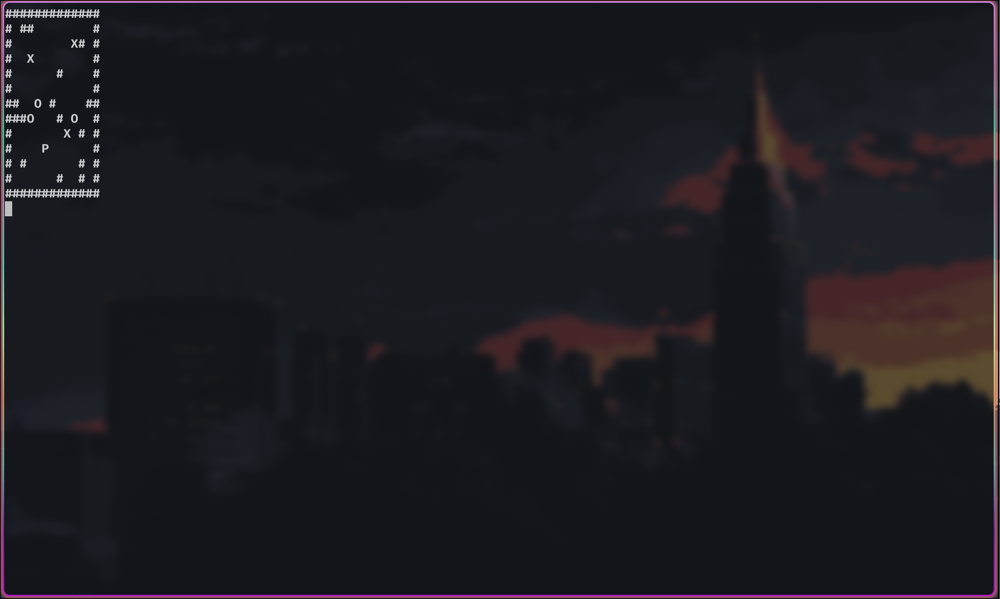

# My Sokoban 🎮

## Game Preview 📸


## Overview 🌟
I've developed "My Sokoban," a game inspired by the classic warehouse keeper challenge. The game is implemented in C using the ncurses library, providing an engaging terminal-based experience.

## Features 🛠️
- **Game Mechanics**: The player pushes boxes to storage locations in a warehouse-like setting.
- **Terminal Graphics**: Utilizes the ncurses library for terminal-based graphics.
- **Gameplay**: Includes handling of player movements and box interactions with a focus on puzzle-solving.
- **Map Design**: Supports custom map designs composed of walls, boxes, and storage locations.

## Enhancements 🚀
- **Complex Maps**: Creation of more challenging maps.
- **UI Improvements**: Enhanced user interface for better game experience.
- **Additional Features**: Considering adding features like undo moves, level selection, and more.

## Reflection 💭
This project aimed to recreate a nostalgic game while adding personal creative enhancements for a unique gameplay experience.

## Prerequisites 📋
- GCC (for compiling a C program)
- ncurses library (for terminal graphics)

## How to Use 🖥️
To compile and run the game, use the following commands:
```bash
make && ./my_sokoban [map_file]
```
You can use the examples maps in the folder maps/ of the repo.

## Key Bindings ⌨️
- **Arrow Keys**: Move the player.
- **Space**: Reset the game.
- **ESC**: Exit the game.

## Game Over 💀
- The game ends when all boxes are on storage locations or when ALL boxes are blocked.


